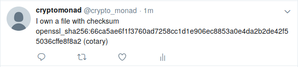

# cotary
Cotary allows you to prove that you have a document without releasing it.

# Motivation
The following scenario describes the motivation for this simple tool:
Alice as an idea that she wants to use; either by publishing it in an article or paper or using it in a product. But she needs help; so she asks Bob to collaborate with her. Alice's idea is so good, though, that she is afraid that Bob will steal the idea from her and not involve her.

To counter this, she needs proof that she had the idea first; but without releasing the idea to the public yet. So she writes a simple draft of her ideas including all important ingredients, calculates a cryptographic hash `H(d)` of this document `d` and stores the document it in a safe place. Before talking to Bob, she publishes the hash. Since `H` is one-way, her ideas are still safe.

In case Bob tries to use Alice's ideas without her approval, she can at a later stage release the document `d` to the world. Since everyone can check that her previously published hash `H(d)` belongs to the document, she now proved that she had the ideas in the document before talking to Bob.

_Cotary_ (code notary) makes this process for Alice very easy. Simply execute `cotary` on a file and it will publish a cryptographically secure hash on your Twitter account. This tweet with a timestamp and the hash proves you had the file at time of publishing.

This shows a _very_ simple use case of hash functions and how to use them in practice.

# Installation
## Installation from PyPI
cotary is [available on PyPI](https://pypi.org/project/cotary/) so installation is very easy using pip:
```
pip install --user cotary
```
Omit `--user` to install it system-wide.

Now, the `cotary` executable should be in your PATH and ready to use.

## Installation from source
Pip can be used to install from source, as well. The `setup.py` file contains everything pip needs to know, so you can install your local copy of the source easily with:
```
$ pip install --user .
```
Omit `--user` to install it system-wide.

Now, the `cotary` executable should be in your PATH and ready to use.

# Configuration
Configuration of Twitter APIs is done using a yaml config file.
At the moment, these are the options. Default config file is in `~/.config/cotary/config.yaml`.

```yaml
twitter:
    message: 'I own a file with checksum {checksum} (cotary)'
    # The following are twitter API keys. Get them from https://dev.twitter.com/apps
    consumer:
        key: null
        secret: null
    access_token:
        key: null
        secret: null
```

# Usage
```
usage: cotary.py [-h] [-c] [--config [CONFIG]] [-q] [file]

Publish the checksum of a file on Twitter.

positional arguments:
  file               File for which to publish checksum. If none is given,
                     read from stdin

optional arguments:
  -h, --help         show this help message and exit
  -c, --calc_only    Only calculate and print the checksum, do not publish it
  --config [CONFIG]  Use given config instead of ~/.local/cotary/config.yaml
  -q, --quiet        Do not print any messages
```

# Example

```
$ ./cotary README.md 
checksum: openssl_sha256:66ca5ae6f1f3760ad7258cc1d1e906ec8853a0e4da2b2de42f55036cffe8f8a2
Status published at 2019-01-16 15:18:38
```

Leads to this Twitter message:



